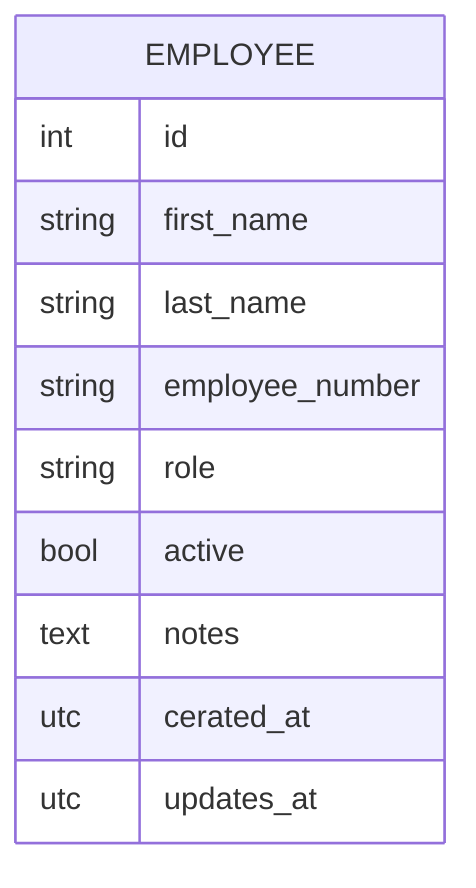

## Database Design (Draft)

TODO: Employee table is missing

This is an initial, high-level ER diagram for the project.  
You can expand it with more entities, attributes, and relations as the design evolves.

### Notes

- **EMPLOYEE**: Job center staff who manage activities and registrations. Stores contact details (`first_name`, `last_name`, `employee_number`), `role`, optional `notes`, and an `active` flag for soft delete.

#### Soft-delete strategy (EMPLOYEE)

Employee records use **soft delete** instead of hard deletion: the `active` column (boolean, default `true`) is set to `false` when an employee is "deleted". This preserves historical data and allows reactivation if needed. Relations to `ACTIVITY` or other entities can be added later for job-center logic.

Feel free to add more attributes (e.g. addresses, constraints, enums) and new entities (e.g. `SESSION`, `PAYMENT`) as needed.
