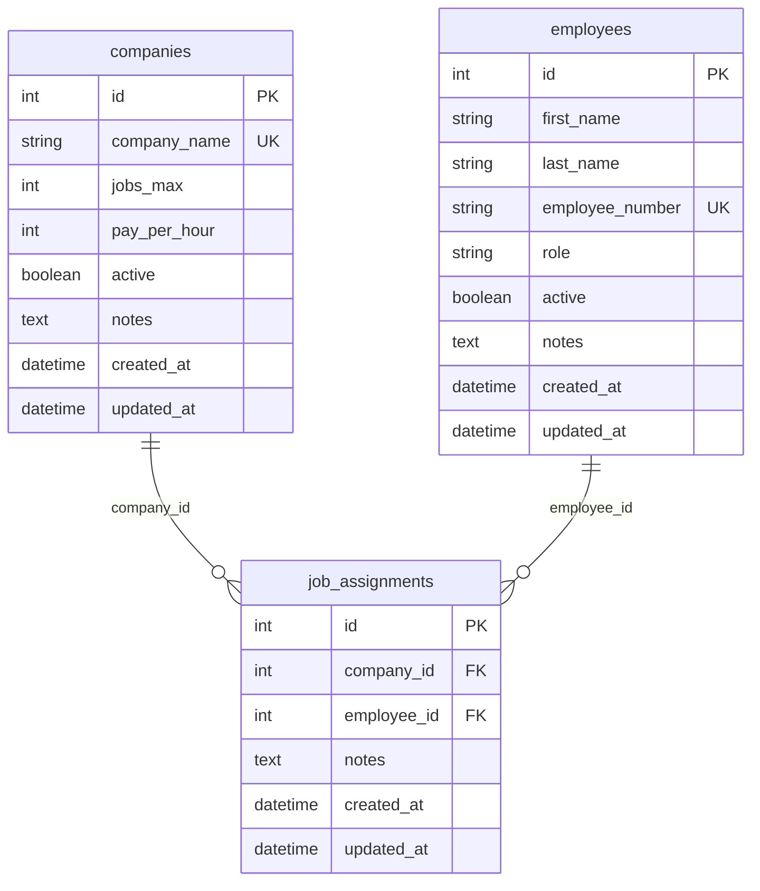

# Database Design

This document describes the MariaDB schema for the LA-Server. Models live in [`app/models.py`](../app/models.py) (Flask-SQLAlchemy). On startup, [`init_db()`](../app/database.py) imports models and runs `db.create_all()` so the schema matches the code. You can also bootstrap an empty database with [`scripts/create_database.py`](../scripts/create_database.py) (creates the DB if needed and relies on the same `create_all()` path).

## Shared base (`BaseModel`)

All concrete tables inherit from `BaseModel` (`__abstract__ = True`):

| Column       | SQLAlchemy type                         | Notes                                      |
|-------------|-----------------------------------------|--------------------------------------------|
| `id`        | `Integer`, PK, autoincrement            | Surrogate key                              |
| `created_at`| `DateTime(timezone=True)`, default `utc_now` | Set on insert                         |
| `updated_at`| `DateTime(timezone=True)`, default `utc_now`, `onupdate=utc_now` | Refreshed on update |

## Tables overview

| Table              | Model            | Purpose |
|--------------------|------------------|---------|
| `companies`        | `Company`        | Employers / stations that offer jobs              |
| `employees`        | `Employee`       | Camp participants in the Spielstadt               |
| `job_assignments`  | `JobAssignment`  | Links one employee to one company for a placement |

---

## `companies`

| Column         | Type              | Constraints / default   |
|----------------|-------------------|-------------------------|
| `id`           | integer           | PK (from `BaseModel`)   |
| `company_name` | `String(255)`     | `NOT NULL`, `UNIQUE`    |
| `jobs_max`     | integer           | `NOT NULL`              |
| `pay_per_hour` | integer           | `NOT NULL` (project units) |
| `active`       | boolean           | `NOT NULL`, default `true` |
| `notes`        | `Text`            | nullable                |
| `created_at`, `updated_at` | datetime (tz) | from `BaseModel` |

**Indexes:** primary key on `id`; unique constraint on `company_name`.

---

## `employees`

| Column            | Type              | Constraints / default   |
|-------------------|-------------------|-------------------------|
| `id`              | integer           | PK (from `BaseModel`)   |
| `first_name`      | `String(255)`     | `NOT NULL`              |
| `last_name`       | `String(255)`     | `NOT NULL`              |
| `employee_number` | `String(16)`      | `NOT NULL`, `UNIQUE`, indexed |
| `role`            | `String(255)`     | `NOT NULL`              |
| `active`          | boolean           | `NOT NULL`, default `true` |
| `notes`           | `Text`            | nullable                |
| `created_at`, `updated_at` | datetime (tz) | from `BaseModel` |

**Indexes:** primary key on `id`; unique index on `employee_number`.

Checksum validation for `employee_number` (ISO 7064 Mod 97,10) is **not** enforced in the database; it is applied in the HTTP API and bulk import when `VALIDATE_CHECK_SUM` is enabled. See [Employee numbers and checksums](./developer-guide.md#employee-numbers-and-checksums).

---

## `job_assignments`

| Column        | Type        | Constraints / default                          |
|---------------|-------------|------------------------------------------------|
| `id`          | integer     | PK (from `BaseModel`)                          |
| `company_id`  | integer     | `NOT NULL`, FK → `companies.id`, `ON DELETE RESTRICT` |
| `employee_id` | integer     | `NOT NULL`, FK → `employees.id`, `ON DELETE RESTRICT` |
| `notes`       | `Text`      | nullable                                       |
| `created_at`, `updated_at` | datetime (tz) | from `BaseModel`                    |

**Indexes:** primary key on `id`; foreign keys on `company_id` and `employee_id`.

**ORM:** `JobAssignment` exposes `companies` → `Company` and `employees` → `Employee` (`back_populates` with `Company.job_assignments` and `Employee.job_assignments`). The attribute names are plural on the assignment side for historical reasons.

---

## Entity-relationship diagram

---

## Behaviour notes

### Company (`companies`)

- Represents an employers in the Spielstadt that offer jobs.
- `company_name` must be unique.
- `jobs_max` caps concurrent assignments for that company (enforced with the API).
- `pay_per_hour` is amount of money the camp participants get for one hour work.
- `active` marks whether the company is offering jobs. `notes` is optional free text.

### Employee (`employees`)

- Typically represents each camp participant (children at the summer camp); the same model may also be used for staff accounts in edge cases.
- **Soft delete:** `active` defaults to `true`. Deleting an employee via the API normally sets `active` to `false` to preserve history; hard delete is a separate API path.

### Job assignment (`job_assignments`)

- Links one employee row to one company row.
- Foreign keys use **`ON DELETE RESTRICT`**: remove or reassign assignments before deleting a company or employee row at the database level.
- Multiple `job_assignments` rows per employee are allowed over time; the **API** enforces at most one current assignment per employee when creating assignments.

### Soft-delete strategy

Prefer `employees.active = false` (and similar business rules for companies in the API) over physical deletes unless you intentionally hard-delete and have cleared dependent rows first.
